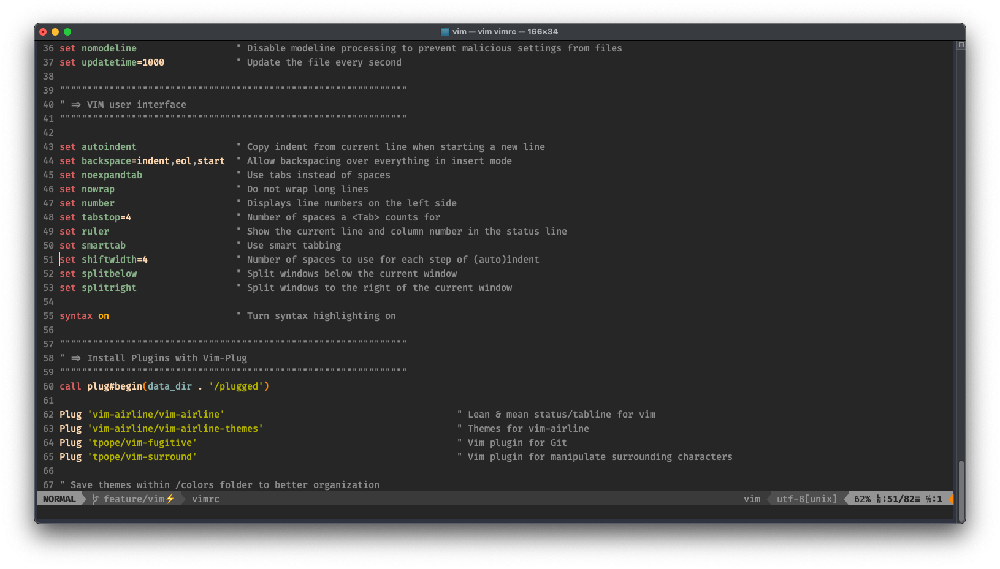

# VIM



This Vim configuration is designed to transform Vim from a simple console-based text editor into a powerful, IDE-like environment for
efficient coding and editing.

## Installation

1. Use `git clone https://github.com/ariellourenco/dotfiles.git` to copy the dotfiles directory to your home folder.
2. Create a symbolic link from the `vim` directory in your Vim configuration location.

```bash
ln -s ~/dotfiles/vim ~/.vim
```

> [!NOTE]
> By default, Vim reads configuration options from [three user-wide configs](https://github.com/vim/vim/blob/master/runtime/doc/starting.txt):
> `.vimrc` in the home directory, `$HOME/.vim/vimrc`, and `$XDG_CONFIG_HOME/vim/vimrc`. The files are searched in the aforementioned order
> and only the first one that is found is read.

When you first launch Vim after setting up this configuration, it will automatically install the necessary plugins.

## Features

## Plugins

To manage plugins efficiently, this configuration uses a plugin manager that simplifies the installation, updating, and removal of Vim
plugins. It keeps your Vim setup organized and easily extensible, enabling you to add functionality such as status lines, git integration,
and text objects without manual hassle.

I personally recommend using [vim-plug](https://github.com/junegunn/vim-plug) but you can choose any plugin manager that suits your
preferences. Below there are a list of plugins used in this setup.

- [vim-airline](https://github.com/vim-airline/vim-airline) – A status and tabline that provides information in a visually appealing manner.
- [vim-fugitive](https://github.com/tpope/vim-fugitive) – Powerful Git integration directly inside Vim.
- [vim-surround](https://github.com/tpope/vim-surround) – Makes manipulating surrounding characters (like parentheses, quotes, tags) simple.

## References

- [The Ultimate vimrc](https://github.com/amix/vimrc/tree/master) – A highly regarded Vim configuration repository.
- [Paulmillr’s dotfiles](https://github.com/paulmillr/dotfiles-vim/blob/master/vimrc) – Another excellent example of a comprehensive Vim configuration.
