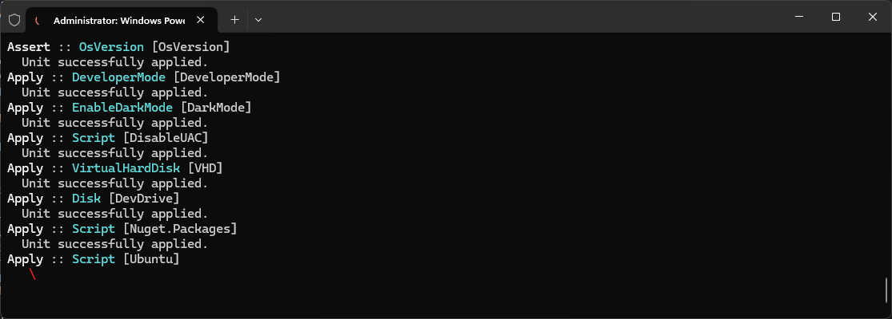

# Windows

This folder contains all the necessary files and steps to customize a new Windows 11 machine with a fancy experience across all its terminal options such as Windows PowerShell, Linux Subsystem on Windows and Windows Terminal 🎨. This is done using a combination of [Windows Package Manager](https://learn.microsoft.com/windows/package-manager/winget/) (WinGet) [Configuration File](https://learn.microsoft.com/windows/package-manager/configuration/) (*configuration.winget*) that will work with the WinGet command line interface (`winget configure --file [path: configuration.winget]`) and manual tasks.

When executed, the `configuration.winget` file will install the following list of applications:

* Git for Windows
* PowerShell 7

It will also apply the following changes on the target machine:

* Enable [Developer Mode](https://learn.microsoft.com/windows/apps/get-started/developer-mode-features-and-debugging)
* Enable Dark Mode
* ~~Enable the Windows Subsystem for Linux optional feature~~
* ~~Enable Virtual Machine Platform optional feature~~
* ~~Install [Ubuntu for WSL](https://learn.microsoft.com/windows/wsl/)~~
* Disable [User Account Control (UAC)](https://learn.microsoft.com/windows/security/application-security/application-control/user-account-control/)
* Set up a [Dev Drive](https://learn.microsoft.com/windows/dev-drive/) of 64Gb using a Virtual Hard Disk (VHD) with a per-user directory path location
* Configure packages cache location on Dev Drive
* Reinstate the Git configurations using the [config files](../git/) stored in this repository
* Set up PowerShell 7 as the default shell for Windows Terminal

> [!IMPORTANT]
> The [PowerShell Desired State Configuration (DSC)](https://learn.microsoft.com/en-us/powershell/dsc/overview?view=dsc-2.0) that enable Windows optional features has been commented out due to an error with winget configuration calls to DSC resource. For further details, see: <https://github.com/microsoft/winget-cli/issues/4264>.

## Requirements

Before proceeding with the `winget configure` command, ensure that your [PowerShellGet](https://learn.microsoft.com/en-us/powershell/gallery/powershellget/install-powershellget) version is `1.6.0` or higher. This is crucial for the correct machine setup. PowerShell 6+ already has a higher version of PowerShellGet built-in, however, Windows PowerShell 5.1 ships an older version of PowerShellGet which doesn't support installing prerelease modules.

The WinGet configuration file provided in this repository has been designed to work with Windows PowerShell 5.1, therefore, we need to install the latest PowerShellGet (if not yet) by running the following command from an elevated Windows PowerShell session:

```powershell
Install-Module -Name PowerShellGet -Force; exit
```

> [!NOTE]
> To improve your experience, make sure a [Nerd Font](https://www.nerdfonts.com) is installed on the host system. This allows the to correctly render all the glyphs used by [Oh My Posh](https://ohmyposh.dev/). The Windows Terminal settings included in this repository use a variant of [Cascadia Code](https://github.com/microsoft/cascadia-code) with integrated [Nerd Font](https://www.nerdfonts.com) icons ✨.

## How to use this folder? 🤔

To use this folder, simple follow the steps below.

1. Download the `configuration.winget` file to your computer.
2. The file can be executed by double-clicking it from File Explorer.
3. (Optional) Open your Windows Start Menu, search and launch "*Windows Terminal*"
4. Type the following:

```powershell
winget configure --file [path: configuration.winget]
```

> [!NOTE]
> Some DSC resources may need to run with administrator privileges. The `securityContext: elevated` field under the directives section of a resource indicates this requirement. When set to elevated, WinGet will prompt for one **UAC approval** at the start of the configuration. WinGet will then launch two processes: one that runs resources with elevated privileges and another that runs resources with the current user's privileges.



### PowerShell Profile

A [PowerShell profile](https://learn.microsoft.com/en-us/powershell/module/microsoft.powershell.core/about/about_profiles) is a script that a PowerShell host loads and executes automatically every time you start that host, letting you customize your environment. It's similar to `.zprofile` and `.zshrc` files in zsh. The script is, in effect, dot-sourced, so any alias, variables, functions, and the like that you define in a profile script remain available in the PowerShell session, which is incredibly handy. I use profiles to create a fancy and productive PowerShell experience.

The [profile](Profile.ps1) available in this folder reflects my preferred setup. It contains modules that help me boost my experience using PowerShell such as [PSReadLine](https://github.com/PowerShell/PSReadLine), which makes PowerShell behave like zsh (that is my favorite shell in *nix-like systems) by giving you substring history search, incremental history search, and awesome tab-completion 🤯. These features significantly enhance productivity by allowing quick access to previously entered commands and providing intelligent suggestions for completing commands.

To automate the setup of PowerShell, the [WinGet configuration file](configuration.winget#L153) has its own `resource` section that symlink the available [PowerShell profile](Profile.ps1) under the user's home directory and install any required PowerShell module as part of the machine setup.

#### PowerShell modules installed

* [CompletionPredictor](https://github.com/PowerShell/CompletionPredictor)
* [PSReadLine](https://github.com/PowerShell/PSReadLine)
* [Posh-Git](https://github.com/dahlbyk/posh-git)
* [Termnal-Icons](https://github.com/devblackops/Terminal-Icons)

> [!IMPORTANT]
> Be aware that complex profiles can cause a significant delay in the startup of PowerShell as it is a script that needs to be executed before the prompt first shows up. For more info about how to speed up your profile, see: <https://devblogs.microsoft.com/powershell/optimizing-your-profile/>

#### Known Issues ☢️

By default, PowerShell stores profile scripts, modules, and configuration files in the user's Documents folder. This placement conflicts with common conventions for shell configurations and can cause problems. For example, if you use OneDrive with [Known Folder Move (KFM)](https://learn.microsoft.com/sharepoint/redirect-known-folders) enabled, these files will be continuously synced to OneDrive, potentially leading to sync conflicts and degraded performance. Additionally, running or updating modules directly from OneDrive folders can cause errors due to file availability or cloud sync interruptions.

There is an open [GitHub Pull Request](https://github.com/PowerShell/PowerShell-RFC/pull/388) proposing to change this default behavior. For more details, see the official blog post: <https://devblogs.microsoft.com/powershell/powershell-openssh-and-dsc-team-investments-for-2025/#moving-powershell-content-folder-out-of-mydocuments>

## Microsoft Office 365

**Microsoft Office 365** is worth a mention in this document. In earlier versions of **Microsoft Office**, users could customize the installation by selecting specific applications. However, in **Office 365**, this is no longer possible. The full Office suite of applications will be installed, whether it is an MSI installation from ISO or a Click-to-Run installation, and it is no longer possible to remove or add individual Office applications.

To achieve this custom installation behavior, Microsoft released the [Office Deployment Tool (ODT)](https://learn.microsoft.com/microsoft-365-apps/deploy/overview-office-deployment-tool) — a command-line tool that provides more control over an Office installation. With ODT, you can define which products and languages are installed, how those products should be updated, and whether or not to display the installation experience.

This tutorial will demonstrate how to use the [configuration file](office/configuration-Office365-x64.xml) with ODT to customize an Office installation or modify an existing one:

1. Right-click **Windows Terminal** or activate its context menu, and then select "*Run as administrator*"
2. Install the ODT by typing the following: `winget install --id=Microsoft.OfficeDeploymentTool -e`
    * The command above download and extract the ODT within the `C:\Program Files\OfficeDeploymentTool` directory
3. Download the `configuration-Office365-x64.xml` file to the ODT command-line tool folder
4. Navigate to the ODT folder and type the following: `setup.exe /configure configuration-Office365-x64.xml`

Or you can use the [WinGet configuration file](office.winget) available in this folder to automate the installation of ODT and the execution of the configuration file as part of the machine setup 🚀.

The final result will be a clean installation of Microsoft 365 Apps with only:

* Microsoft Excel
* Microsoft OneNote
* Microsoft PowerPoint
* Microsoft Word

You can [customize](https://learn.microsoft.com/microsoft-365-apps/deploy/office-deployment-tool-configuration-options) this list by updating the `configuration-Office365-x64.xml` file with your required apps.

## References 📚

* [DSC Samples](https://github.com/microsoft/winget-dsc/tree/main/samples)
* [Intelligent Apps Dev Box Customization](https://github.com/microsoft/devcenter-examples/tree/main/devbox-intelligent-apps)
* [Set up a WSL development environment](https://learn.microsoft.com/windows/wsl/setup/environment)
