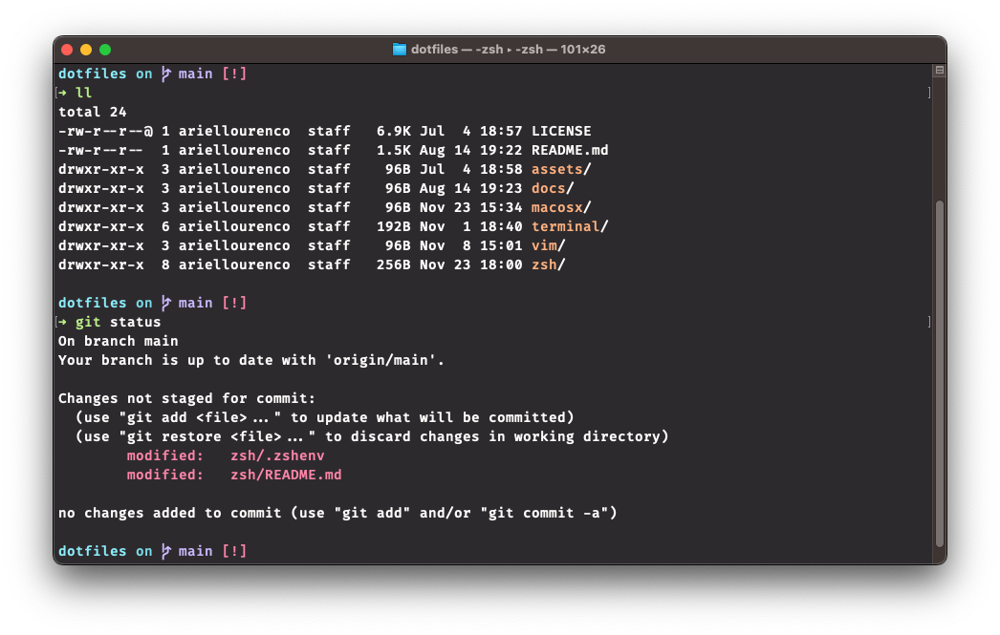

               _
              | |
       _______| |__  _ __ ___
      |_  / __| '_ \| '__/ __|
     _ / /\__ \ | | | | | (__
    (_)___|___/_| |_|_|  \___|

Almost every developer cares about the development setup to suit all the needs and personal preferences. If you’re looking for a clean and customizable setup, here’s a lightweight Zsh configuration to get started. It brings in auto-completion and syntax highlighting features, displays git status in the prompt and auto-resizes to fit your commands.

This Zsh configuration keeps things minimal and flexible, providing a solid base you can make your own.

## Requirements

Before proceeding, ensure that a [Nerd Font](https://www.nerdfonts.com) is installed and configured for your terminal. [Fira Code](https://github.com/tonsky/FiraCode) is a popular choice. To confirm the setup is correct, run the following command in your terminal:

```bash
echo -e "\xee\x82\xa0"
```

If you see a git branch glyph as output, it means your terminal is successfully rendering the Nerd Font glyphs. If not, double-check your font settings and ensure you have installed a compatible Nerd Font.

## ZSHENV

> Home is where you're supposed to be most comfortable in. It is your place of refuge, and a sanctum from the mess and chaos of the outside world. It is where you have complete liberty over everything: what you do, when you do things, how you do them, what things you have. It is where these things are supposed to be where you want them, and how you want them to be. <br />
by _Sharadh Rajaraman_

The **.zshenv** file included in this repository is designed to keep your `$HOME` clean and tidy. It defines a set of environment variables that are available to all shell instances, such as `$PATH`, `$EDITOR` and other several environment variables that attempt to standardise dot-files and dot-directories based on the [XDG Base Directory Specification](https://specifications.freedesktop.org/basedir-spec/basedir-spec-latest.html).

The table below depicts the most important XDG environment variables used across *nix systems and its counterparts values on MacOS:

| **Variable**       | **Default value**    | **OSX**                         | **Details**                                                                                                                                                      |
|--------------------|----------------------|---------------------------------|------------------------------------------------------------------------------------------------------------------------------------------------------------------|
| `$XDG_CACHE_HOME`  | `$HOME/.cache`       | `~/Library/Caches`              | Caches limited to single runs of a program, but can extend to persistent caches, e.g. user-installed package manager caches for `pip`, `pacman`, `vcpkg`, etc.   |
| `$XDG_CONFIG_HOME` | `$HOME/.config`      | `~/Library/Preferences`         | User-specific configuration files, including `.*rc` and `.*env` files; VS Code `settings.json`.                                                                  |
| `$XDG_DATA_HOME`   | `$HOME/.local/share` | `~/Library/Application Support` | User-specific data files; e.g. program databases, caches that persist through multiple program runs, search indices, 'Trash' directory for desktop environments. |
| `$XDG_STATE_HOME`  | `$HOME/.local/state` | `~/Library/Application Support` | User-specific state files, such as terminal history files.                                                                                                       |

> [!NOTE]
> These mappings seem pretty reasonable but they aren't exact. Some data may be more appropriate for `~/Library/My App` or some configuration file for `~/Library/Application Support`, for instance, the [choice](https://pkg.go.dev/os#UserConfigDir) made by the `OS` package in `golang` maps `$XDG_CONFIG_HOME` to `~/Library/Application Support`. For further details, see:
[Mac OS Directories](https://developer.apple.com/library/archive/documentation/FileManagement/Conceptual/FileSystemProgrammingGuide/MacOSXDirectories/MacOSXDirectories.html).

Unfortunately, although the [XDG Base Directory specification](https://specifications.freedesktop.org/basedir-spec/basedir-spec-latest.html) defines clear locations where configuration files should be placed and, as a user, you expect that softwares adhere to these specifications, the truth is that there are a myriad of programs that does not respect the specification and writes data to a non-canonical location in the user's home directory.

The Arch Wiki has a [list of programs](https://wiki.archlinux.org/title/XDG_Base_Directory#Support) that are XBD-compliant by default and those with hard-coded non-XBD paths. The latter two lists combined is almost twice as long as the compliant list, and includes some very prominent *nix-first software like Bash, ZSH, and Firefox.

> [!IMPORTANT]
> It's worth noting that even though some programs support [XDG Base Directory specification](https://specifications.freedesktop.org/basedir-spec/basedir-spec-latest.html) it isn't enabled by default, the presence of a file in the specified directory indicates that programs should enable this feature. For instance, starting with version [9.1.0327](https://github.com/vim/vim/commit/c9df1fb35a1866901c32df37dd39c8b39dbdb64a), [Vim has incorporated support for the XDG Base Directory Specification](https://github.com/vim/vim/pull/14182). By default, Vim reads configuration options from [three user-wide configs](https://github.com/vim/vim/blob/master/runtime/doc/starting.txt): `.vimrc` in the home directory, `$HOME/.vim/vimrc`, and `$XDG_CONFIG_HOME/vim/vimrc`. The first that exists is used, the others are ignored.
>
> The same strategy is used by Git, which reads configuration options from [two user-wide configs](https://git-scm.com/docs/git-config#_configuration): `.gitconfig` in the home directory, and `$HOME/.config/git/config` unless `$XDG_CONFIG_HOME/git/config` is set.

Below is a list of open issues worth monitoring if you are a .NET developer :rocket::

| **Application**         | **Path**                          | **Discussion**        |
|-------------------------|-----------------------------------|-----------------------|
| .NET Runtime            | `~/.microsoft/`                   | [1](https://github.com/dotnet/runtime/issues/101012)            |
| ASP.NET Core            | `~/.aspnet/`                      | [2](https://github.com/dotnet/aspnetcore/issues/43278)          |
| Mono                    | `~/.mono/`                        | [3](https://github.com/mono/mono/pull/12764)                    |
| C# Dev Kit for VS Code  | `~/.ServiceHub/`                  | [4](https://github.com/microsoft/vscode-dotnettools/issues/514) |
| Visual Studio Code      | `~/.vscode[-variant]/extensions/` | [5](https://github.com/microsoft/vscode/issues/3884)            |

> [!NOTE]
> By default, Git reads configuration options from [two user-wide configs](https://git-scm.com/docs/git-config#_configuration): `.gitconfig` in the home directory, and `$HOME/.config/git/config` unless `$XDG_CONFIG_HOME/git/config` is set. Since neither of these are Windows-native directories, [Git for Windows now looks for Git/config in the AppData directory](https://github.com/git-for-windows/git/pull/5030), unless `$HOME/.config/git/config` exists. Worth note that this feature isn't enable by default, the presence of the file in one of the specified directories as a cue that the user wants to use this feature, therefore, we need to create it manually.

## ZSHRC

The `.zshrc` file in this repository is thoughtfully designed to optimize your Zsh shell experience. Whether you're a seasoned developer or just beginning with Zsh, this configuration offers a robust foundation to boost your productivity and streamline your workflow. It leverages powerful plugins to enable features like [auto-suggestions](https://github.com/zsh-users/zsh-autosuggestions), [syntax highlighting](https://github.com/zsh-users/zsh-syntax-highlighting), and enhanced [completion](https://github.com/zsh-users/zsh-completions) capabilities, providing a smoother and more efficient terminal experience.

The file is structured for clarity, modularity, and ease of customization. Core configurations, such as history management and shell behavior, are defined at the top for quick access. Plugin and module sourcing is organized to leverage external files (`aliases.zsh`, `completion.zsh`, `key-bindings.zsh`), making it easier to maintain and extend functionality without cluttering the main `.zshrc` file. This modular approach not only enhances readability but also promotes reusability and scalability. Additionally, environment-specific setups like GPG configuration and prompt integration are encapsulated in dedicated sections, ensuring a logical flow and separation of concerns throughout the file.

Below is a brief description of some key modules/sections included:

### Key Binding

MacOS's Terminal.app has a long-standing issue where certain keyboard shortcuts, such as `Home`, `End`, `Delete`, and others, do not work as expected in terminal applications like Zsh, Bash, or Vim. This is because these keys send specific escape sequences (control codes) that need to be correctly mapped by the terminal emulator to the desired actions in the shell or application.

By default, Terminal.app does not have proper mappings for these keys, resulting in unexpected behavior like:

- `Home` and `End` not moving the cursor to the beginning or end of a line.
- `Delete` behaving inconsistently or not working at all.
- `Option-Arrow` keys failing to navigate by words.

The [key-bindings.zsh](modules/key-bindings.zsh) module addresses this problem by explicitly mapping the escape sequences generated by these keys to their intended functions. Additionally, this repository includes three Terminal.app profiles that are configured to send the proper escape sequences for the aforementioned keys.

The table below depicts the list of key bindings configured:

| **Key Combination**  | **Action**                            | **Description**                                                  |
|----------------------|---------------------------------------|------------------------------------------------------------------|
| `Home`               | `beginning-of-line`                   | Move the cursor to the beginning of the line.                    |
| `End`                | `end-of-line`                         | Move the cursor to the end of the line.                          |
| `Delete`             | `delete-char`                         | Delete the character under the cursor.                           |
| `Ctrl-Delete`        | `kill-word`                           | Delete the word after the cursor.                                |
| `Option-Left Arrow`  | `backward-word`                       | Move the cursor one word backward.                               |
| `Option-Right Arrow` | `forward-word`                        | Move the cursor one word forward.                                |
| `Shift-Tab`          | `reverse-menu-complete`               | Move backwards through the completion menu.                      |
| `Ctrl-r`             | `history-incremental-search-backward` | Incrementally search backward in history for a specified string. |
| `Space`              | `magic-space`                         | Insert a space without triggering history expansion.             |

### Prompt

The prompt in this Zsh configuration is powered by [Spaceship](https://spaceship-prompt.sh/), a minimalistic yet powerful and highly customizable Zsh prompt. Spaceship provides a clean and modern look, displaying only relevant information dynamically. Additionally, the Terminal.app is further styled with the [Monokai Pro](https://monokai.pro) theme to ensure a visually appealing and consistent terminal experience.

Below is an example of how the prompt might look during typical use:



#### Other Great Themes

While [Monokai Pro](https://monokai.pro) is the default in this setup, there are many excellent terminal themes with great support and documentation. Three standout options are:

- [Dracula](https://draculatheme.com): A dark theme with vibrant colors and wide compatibility.
- [Nord](https://www.nordtheme.com): A cool, Arctic-inspired theme with a focus on readability.
- [One Half](https://github.com/sonph/onehalf): A modern theme with a clean and consistent color palette.

Feel free to experiment with these themes to find the one that best suits your preferences!

## References

- [$HOME, Not So Sweet $HOME](https://gist.github.com/sharadhr/39b804236c1941e9c30d90af828ad41e)
- [Dotfile madness](https://0x46.net/thoughts/2019/02/01/dotfile-madness/)
- [Dotfiles Are Everywhere. We've Lost Control Of Our Home Directories!](https://www.youtube.com/watch?v=AFtfpluqv14)
- [Configuring Zsh Without Dependencies](https://thevaluable.dev/zsh-install-configure-mouseless/)
- [Zsh Lovers](https://grml.org/zsh/zsh-lovers.html)
